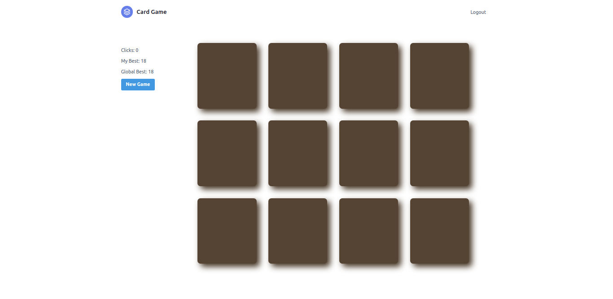
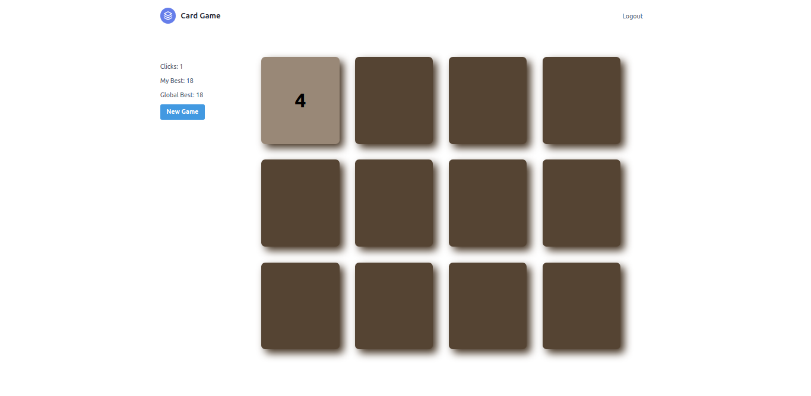
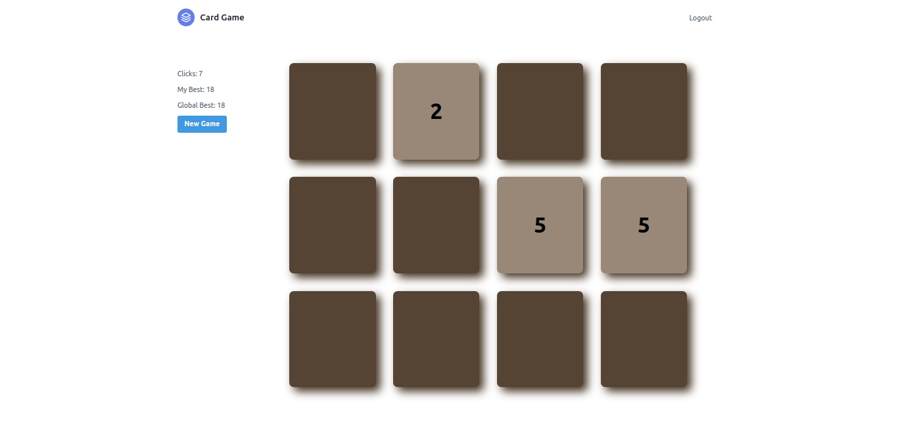
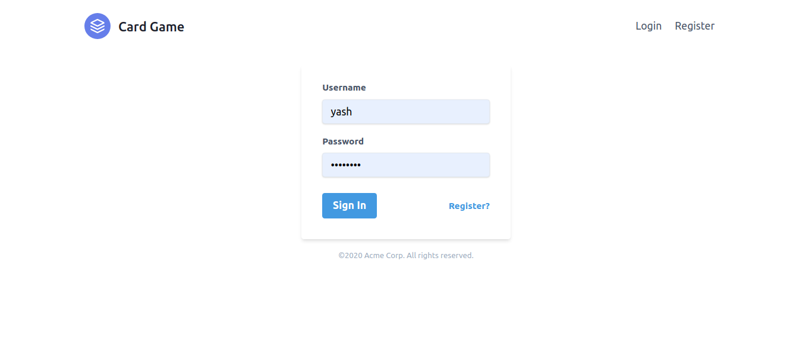
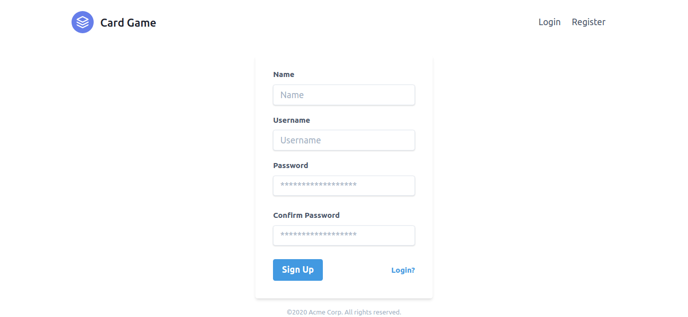

# CARD MEMORY GAME

This is a memory based game. The player who takes the least amount of clicks to open all the cards will win. The least possible amount of clicks will be 12.

### Installation
1. Install Docker and Docker Compose on the server
2. Clone this github repository on the virtual machine
3. Create a file `.env` inside the main folder
4. Generate a secret key by `openssl rand -hex 32` 
5. Create a variable `SECRET_KEY` in the `.env` file as `SECRET_KEY={}` where `{}` will be replaced by the secret key.
6. Change the hostname in `frontend/pages/index.tsx`
7. CD into the main folder
8. Run `docker-compose build`
9. Run `docker-compose up`
10. Expose post 80 and 8000 from the server

### Gallery

